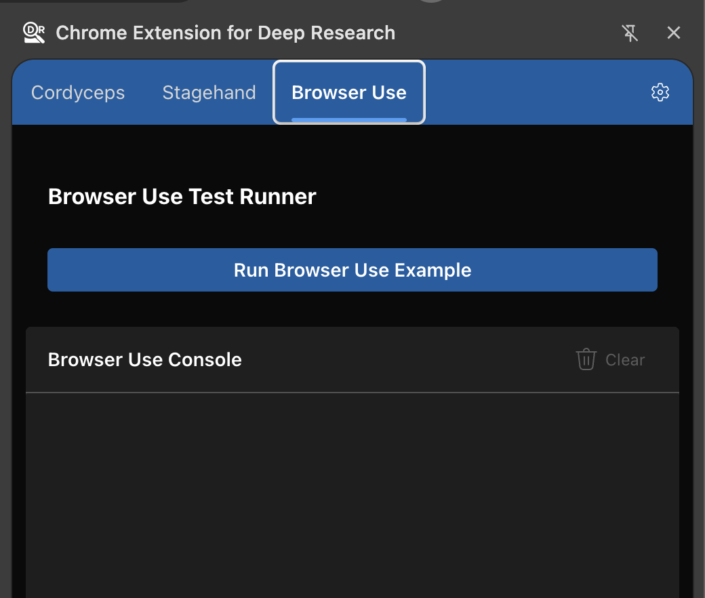

# Chrome Extension Automation Proof of Concept

## About

**This is a proof of concept demonstrating how to run Playwright's and Puppeteer's client APIs without using Chrome DevTools Protocol (CDP) in a Chrome Extension, using only Chrome extension APIs and DOM APIs.**

This repository showcases advanced automation and DOM interaction capabilities running entirely inside the browser, without relying on the Chrome DevTools Protocol.

### Cordyceps

Cordyceps is a port of Playwright's and Puppeteer's client APIs that runs inside a Chrome extension using Chrome extension APIs and standard DOM APIs—no Chrome DevTools Protocol required.

### Browser‑Use

Browser‑Use is a TypeScript port of [Browser Use](https://github.com/browser-use/browser-use) adapted to run entirely within a Chrome extension, enabling in‑page automation and DOM interactions using extension and DOM APIs.

*TypeScript port: [browser-use-ts](https://github.com/Vadavision/browser-use-ts)*

### Stagehand

Stagehand is a port of [Stagehand](https://stagehand.dev) designed to run in a Chrome extension environment for in‑browser reasoning, extraction, and automation workflows.

*Documentation: [docs.stagehand.dev](https://docs.stagehand.dev)*

## Demo Videos

### Cordyceps in Action

<video src="https://github.com/user-attachments/assets/a35f3c8e-ac2d-4990-84ae-3d650a07c211" controls poster="docs/media/cordyceps-thumb.jpg">
  
  <p>Your browser does not support the video tag. <a href="https://github.com/user-attachments/assets/a35f3c8e-ac2d-4990-84ae-3d650a07c211">Click here to watch the Cordyceps demo</a></p>
</video>

### Browser Use & Stagehand Demo

<video src="https://github.com/user-attachments/assets/1ae9c6de-b670-4a86-ab4e-ef31d131ec87" controls poster="docs/media/browser-use-thumb.jpg">
  
  <p>Your browser does not support the video tag. <a href="https://github.com/user-attachments/assets/1ae9c6de-b670-4a86-ab4e-ef31d131ec87">Click here to watch the Browser Use & Stagehand demo</a></p>
</video>

## Installation

### Prerequisites

Make sure you have [pnpm](https://pnpm.io/) installed on your system.

### Setup

1. Install dependencies:

   ```bash
   pnpm install
   ```

2. Start the development environment:

   ```bash
   pnpm dev
   ```

   This command starts:
   - The Chrome extension development build with hot reloading
   - A web page fixture server at <http://localhost:3005> (required for Cordyceps playground testing)

3. Install the Chrome extension:

   1. Open Chrome and navigate to `chrome://extensions/`
   2. Enable **Developer mode** by toggling the switch in the top-right corner
   3. Click the **"Load unpacked"** button
   4. Select the `dist` folder from this project directory
   5. The extension should now appear in your extensions list and be active
   6. (Optional) Pin the extension to your toolbar by clicking the puzzle piece icon in Chrome's toolbar and then clicking the pin icon next to the extension

## Running Tests

Once the extension is installed, you can test the different automation systems using the built-in test runners.

### 1. Cordyceps Tests (No API Key Required)


- Click the **Cordyceps** tab in the extension
- Click **"Run Locator Test"** to test DOM element location and interaction
- No API key required - tests run using built-in functionality

### 2. Stagehand Tests (OpenAI API Key Required)


- Click the **Stagehand** tab in the extension
- Click **"🐘 Elephant Research Test"** to run the AI-powered research workflow
- **Requires OpenAI API key** (only OpenAI models are supported)

### 3. Browser Use Tests (OpenAI API Key Required)



- Click the **Browser Use** tab in the extension  
- Click **"Run Browser Use Example"** to test browser automation workflows
- **Requires OpenAI API key** (only OpenAI models are supported)

### Setting up API Keys


To run Stagehand and Browser Use tests:

1. Click the ⚙️ settings button in the extension
2. Enter your OpenAI API key in the **"OpenAI (ChatGPT) API Key"** field
3. Click **"Save"**
4. You can now run the AI-powered tests

## AI Snapshot Technology

## About

This repository is a Chrome extension workspace for deep research that runs advanced automation and DOM interaction fully inside the browser, without relying on the Chrome DevTools Protocol.

### Cordyceps

Cordyceps is a port of Playwright’s and Puppeteer’s client APIs that runs inside a Chrome extension using Chrome extension APIs and standard DOM APIs—no Chrome DevTools Protocol required.

### Browser‑Use

Browser‑Use is a TypeScript port of Browser Use adapted to run entirely within a Chrome extension, enabling in‑page automation and DOM interactions using extension and DOM APIs.

### Stagehand

Stagehand is a port of Stagehand designed to run in a Chrome extension environment for in‑browser reasoning, extraction, and automation workflows.

## AI Snapshot Technology

Instead of traditional screenshot-based automation, this system uses Playwright's new **AI snapshot API** (`snapshotForAI()`) to generate structured text representations of web pages. This approach offers several advantages:

### Text-Based Page Analysis

The `snapshotForAI()` method creates accessibility-tree-based snapshots that capture:

- Semantic structure and hierarchy of page elements
- Interactive elements with proper labeling and roles
- Form fields, buttons, and navigation elements
- Iframe content with intelligent resolution strategies

### Key Benefits

- **Faster Processing**: Text snapshots are significantly smaller than images and process faster
- **Better Accuracy**: Semantic understanding rather than visual pixel analysis
- **Cross-Platform Consistency**: Text representation works identically across different screen sizes and zoom levels
- **Lower Resource Usage**: No image processing or computer vision overhead

### Implementation Details

Instead of traditional screenshots, the system generates structured text snapshots that AI can understand semantically. **The revolutionary frame-piercing capability** allows Cordyceps to see through iframes, shadow DOM, and nested contexts that typically block automation tools.

Here's an example of what an AI snapshot looks like, showing **cross-frame element detection**:

```text
Aria snapshot for AI 
 - generic [ref=e2]:
  - heading "Cordyceps Example Domain - Enhanced Testing Page" [level=1] [ref=e3]
  - paragraph [ref=e4]: This enhanced domain is for use in Cordyceps testing. It includes various interactive elements to test automation capabilities including iframes, shadow DOM, and form controls.
  - generic [ref=e5]:
    - strong [ref=e6]: "Test page note:"
    - text: This page is used to test
    - strong [ref=e7]: "@packages/playwright-testing"
    - text: . You can see the test examples in
    - strong [ref=e8]: tests/locator
    - text: folder.
  - generic [ref=e9]:
    - heading "Embedded Iframes" [level=3] [ref=e207]
    - 'heading "Iframe 1: Simple Content" [level=4] [ref=e208]'
    - iframe [ref=e209]:
      - heading "Frame 1 Content" [level=2] [ref=f1e3]
      - paragraph [ref=f1e4]: This content is inside the first iframe and fully accessible to Cordyceps.
      - button "Click Me (Frame 1)" [ref=f1e5] [cursor=pointer]
      - generic [ref=f1e6]:
        - checkbox "Frame 1 Checkbox" [ref=f1e7]
        - text: Frame 1 Checkbox
    - 'heading "Iframe 2: Content with Nested Iframe" [level=4] [ref=e210]'
    - iframe [ref=e211]:
      - heading "Frame 2 with Nested Content" [level=2] [ref=f2e3]
      - paragraph [ref=f2e4]: This iframe contains another nested iframe - watch Cordyceps pierce through both levels!
      - iframe [ref=f2e5]:
        - heading "Nested Frame Content" [level=3] [ref=f3e2]
        - button "Deep Nested Button" [ref=f3e3] [cursor=pointer]
        - textbox "Deep Input Field" [ref=f3e4]
        - generic [ref=f3e5]:
          - radio "Nested Option 1" [ref=f3e6]
          - text: Nested Option 1
        - generic [ref=f3e7]:
          - radio "Nested Option 2" [checked] [ref=f3e8]
          - text: Nested Option 2
  - generic [ref=e199]:
    - heading "🌟 Shadow DOM Element" [level=4] [ref=e200]
    - paragraph [ref=e201]: This content is inside a shadow DOM and isolated from the main document!
    - button "Click Me (Shadow)" [ref=e202] [cursor=pointer]
    - generic [ref=e204]:
      - checkbox "Shadow Checkbox" [ref=e205]
      - text: Shadow Checkbox
```

### Frame-Piercing Locator Usage

**Cordyceps' game-changing capability**: Unlike traditional automation tools that struggle with iframes and shadow DOM, Cordyceps seamlessly locates and interacts with elements across **any level of nesting**:

```typescript
// Frame-piercing ARIA ref locators - work across ANY iframe depth!
const page = await browserWindow.getCurrentPage();

// Locate elements in main document using ARIA refs
const mainButton = page.locator('aria-ref=e45');           // Main document button
const mainCheckbox = page.locator('aria-ref=e40');         // Main document checkbox

// Locate elements INSIDE first iframe using frame refs (f1e...)
const frameButton = page.locator('aria-ref=f1e5');         // Button inside first iframe
const frameCheckbox = page.locator('aria-ref=f1e7');       // Checkbox inside first iframe

// Locate elements in NESTED iframe using nested frame refs (f3e...) - multiple levels deep!
const deepNestedButton = page.locator('aria-ref=f3e3');    // Button in deeply nested iframe
const deepInputField = page.locator('aria-ref=f3e4');      // Input field in nested iframe
const nestedRadio1 = page.locator('aria-ref=f3e6');        // Radio button option 1
const nestedRadio2 = page.locator('aria-ref=f3e8');        // Radio button option 2 (selected)

// Locate elements in Shadow DOM using standard refs
const shadowButton = page.locator('aria-ref=e202');        // Button in shadow DOM
const shadowCheckbox = page.locator('aria-ref=e205');      // Checkbox in shadow DOM

// ALL of these work seamlessly with ARIA refs - no frame switching required!
await frameButton.click();           // Clicks aria-ref=f1e5 inside iframe
await deepNestedButton.click();      // Clicks aria-ref=f3e3 in nested iframe  
await shadowButton.click();          // Clicks aria-ref=e202 in shadow DOM
await deepInputField.fill('test');   // Types in aria-ref=f3e4 deeply nested iframe
await nestedRadio2.check();          // Selects aria-ref=f3e8 radio in nested iframe

console.log('ARIA ref frame-piercing test completed successfully!');
console.log('Cordyceps accessed elements across multiple iframe levels using aria-ref selectors');
```