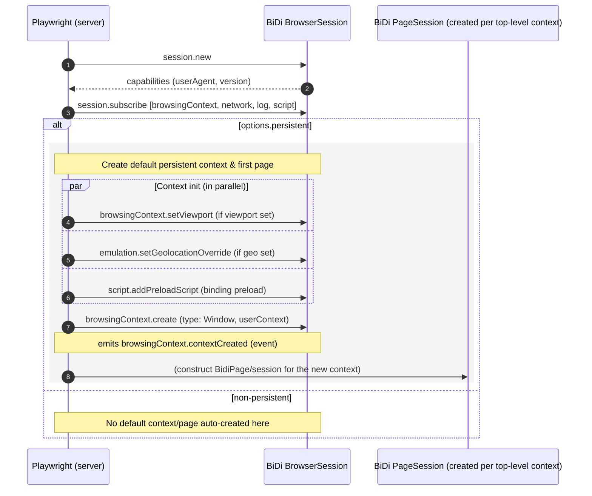

Got it, Mr. Sohn. Below is a clean inventory of every **BiDi command** this code sends (grouped by class/file), followed by compact **sequence/parallel flow charts** showing when they fire in a typical “connect → first page → navigate” lifecycle.

---

# Inventory — messages sent to WebDriver BiDi (by file/class)

## BidiBrowser

* `session.new` — during `connect`
* `session.subscribe` — during `connect`
* `browser.createUserContext` — in `doCreateNewContext(...)`
* *(dispatch-only; created elsewhere)* `createMainFrameBrowsingContextSession(...)` (not a BiDi command, just session plumbing)

## BidiBrowserContext

* `browsingContext.create` — in `_createNewPageImpl(...)`
* `storage.getCookies` — in `doGetCookies(...)`
* `storage.setCookie` — in `addCookies(...)` (per cookie)
* `storage.deleteCookies` — in `doClearCookies(...)`
* `permissions.setPermission` — in `_setPermission(...)` (grant/clear)
* `emulation.setGeolocationOverride` — in `setGeolocation(...)`
* `script.addPreloadScript` — in `doAddInitScript(...)`
* `script.removePreloadScript` — in `doRemoveInitScripts(...)` (per id)
* `browsingContext.setViewport` — in `doUpdateDefaultViewport(...)`
* `script.addPreloadScript` — in `doExposePlaywrightBinding(...)`
* `script.callFunction` — in `doExposePlaywrightBinding(...)` (for each main-world realm)
* `browser.removeUserContext` — in `doClose(...)`

## BidiPage

* `script.evaluate` *(sendMayFail)* — in `_touchUtilityWorld(...)`
* `browsingContext.handleUserPrompt` — in `_onUserPromptOpened(...)`
* `browsingContext.navigate` — in `navigateFrame(...)`
* `browsingContext.activate` — in `bringToFront(...)`
* `browsingContext.setViewport` — in `updateEmulatedViewportSize(...)`
* `browsingContext.reload` — in `reload(...)`
* `browsingContext.traverseHistory` — in `goBack(...)`, `goForward(...)`
* `script.addPreloadScript` — in `addInitScript(...)`
* `script.removePreloadScript` — in `removeInitScripts(...)`
* `browsingContext.close` — in `closePage(...)`
* `browsingContext.captureScreenshot` — in `takeScreenshot(...)`
* `input.setFiles` — in `setInputFilePaths(...)`

## BidiExecutionContext

* `script.evaluate` — in `rawEvaluateJSON(...)`, `rawEvaluateHandle(...)`
* `script.callFunction` — in `evaluateWithArguments(...)`, `_rawCallFunction(...)`
* `script.disown` — in `releaseHandle(...)`

## BidiNetworkManager (+ route)

* `network.setCacheBehavior` — in `_updateProtocolRequestInterception(...)`
* `network.addIntercept` — in `_updateProtocolRequestInterception(...)`
* `network.removeIntercept` — in `_updateProtocolRequestInterception(...)`
* `network.continueRequest` *(sendMayFail)* — in `_onBeforeRequestSent(...)` (redirect case) and `BidiRouteImpl.continue(...)`
* `network.provideResponse` *(sendMayFail)* — in `BidiRouteImpl.fulfill(...)`
* `network.failRequest` *(sendMayFail)* — in `BidiRouteImpl.abort(...)`
* `network.continueWithAuth` *(sendMayFail)* — in `_onAuthRequired(...)`

> Notes
> • All `...sendMayFail(...)` calls intentionally ignore transport errors (best-effort).
> • “Browser-level” calls use `this._browserSession`; “page/frame-level” calls use the per-page `this._session`.

---

# Flow — when these messages fire (sequential vs parallel)

## 1) Connect & (optional) persistent context boot

**Key ordering:**

1. `session.new` → 2) `session.subscribe` are **sequential**.
   Persistent boot then runs a **parallel** init (`setViewport`, `setGeolocationOverride`, optional `addPreloadScript`) before/around `browsingContext.create`.

---

## 2) Page wiring right after `contextCreated`

**Parallelism:**
Inside `_initialize()`, Playwright runs:

* `updateHttpCredentials()` → may call `_updateProtocolRequestInterception()`
* `updateRequestInterception()` → `_updateProtocolRequestInterception()`
* `waitForBlockingPageCreations()`
  Those two updates can each trigger **parallel** `network.setCacheBehavior` and `network.addIntercept/removeIntercept` (joined with `Promise.all`).

---

## 3) Navigation & request interception

**Ordering:**

* `browsingContext.navigate` is **sequentially** issued by your `goto`-style path.
* Interception-related sends (`continueRequest` / `provideResponse` / `failRequest` / `continueWithAuth`) occur **asynchronously**, driven by incoming network events. Multiple in-flight requests can cause these to happen **in parallel** across requests.

---

## 4) Script evaluation & bindings

**Parallelism:**

* The “install binding into each realm” loop may fan out **in parallel** to multiple realms.
* Per-frame `script.evaluate` (utility world ping) occurs on each main-world realm creation.

---

## Handy cross-reference (which session sends what)

* **Browser-level (`_browserSession`):** `session.*`, `browser.*`, `storage.*`, `permissions.*`, `emulation.*`, context-wide `browsingContext.*` with `userContexts: [...]`, context-wide `script.add/removePreloadScript`, `script.callFunction` (binding install).
* **Page-level (`_session`):** `browsingContext.navigate/activate/reload/traverseHistory/close/setViewport/captureScreenshot/handleUserPrompt`, `input.setFiles`, `script.evaluate/callFunction/disown/addPreloadScript/removePreloadScript`, and **all** `network.*` controls (cache behavior, intercepts, continue/provide/abort/auth).
